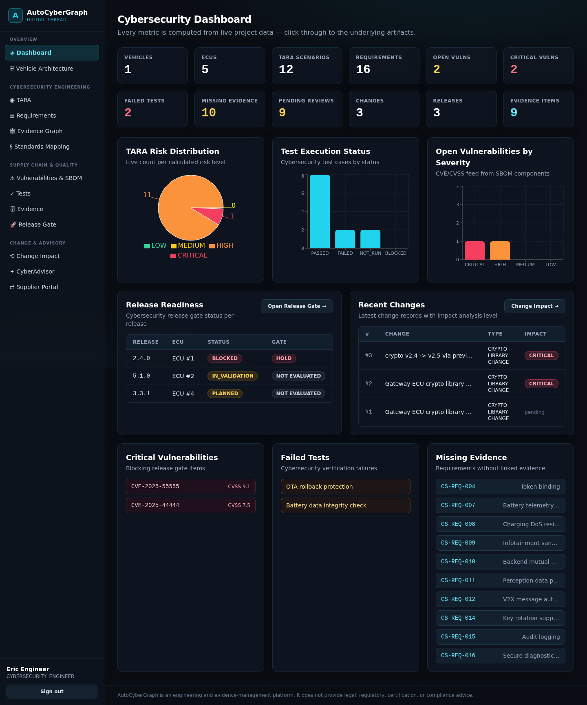
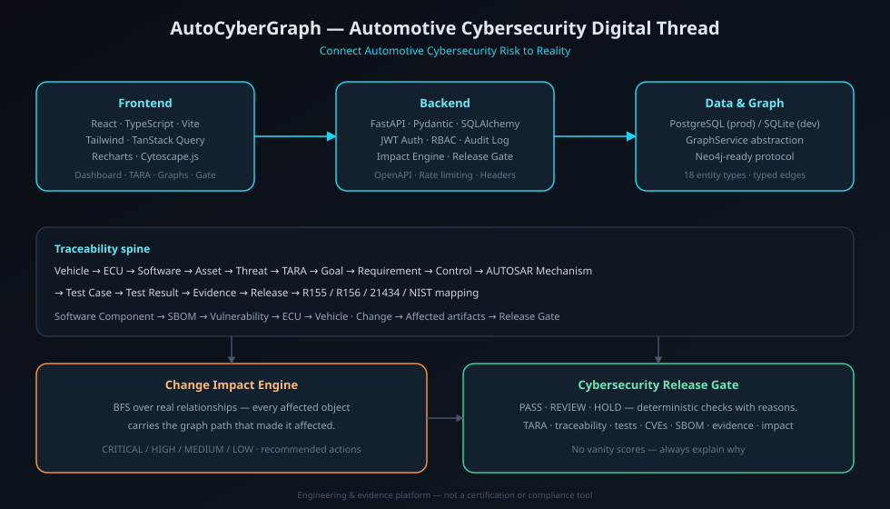

# AutoCyberGraph

> **Connect Automotive Cybersecurity Risk to Reality.**

<p align="center">
  
</p>

<p align="center">
  
</p>

**AutoCyberGraph** is an open-source prototype exploring how automotive cybersecurity engineering can be
represented as a **connected digital thread**: from TARA and cybersecurity requirements to AUTOSAR
implementation, vulnerabilities, testing and regulatory evidence — with **Change Impact Analysis** across
the entire lifecycle.

It combines concepts from **ISO/SAE 21434**, **UNECE R155**, **UNECE R156**, **NIST SP 800-53** and
**AUTOSAR security** as reference/mapping layers.

> **Disclaimer:** AutoCyberGraph is an engineering and evidence-management platform.
> It does not provide legal, regulatory, certification, or compliance advice.
> These standards/frameworks are represented as reference/mapping concepts. AutoCyberGraph is **not** an
> official implementation, certification tool, or compliance guarantee of any of them.

---

## The problem

Cybersecurity artifacts live in disconnected tools — TARA in spreadsheets, requirements in requirements
management, tests in ALM, SBOMs in build pipelines, evidence in shared drives. When a crypto library,
ECU configuration or CAN message changes, nobody can answer — *with evidence* — which cybersecurity
goals, requirements, tests and release evidence are affected.

## The solution

One traceability graph, one impact engine, one release gate:

```
Vehicle → ECU → Software → Asset → Threat → TARA → Cybersecurity Goal → Requirement
→ Security Control → AUTOSAR Security Mechanism → Test → Vulnerability
→ Evidence → Release → R155 / R156 / 21434 / NIST mapping
```

**Key differentiator:** record a change (e.g. *Gateway ECU crypto library v2.4 → v2.5*) and the
Change Impact Engine traverses the evidence graph to list every affected artifact — **each with the
graph path that made it affected**. No guesses.

## Features

- 🚗 **Vehicle architecture** — ECU topology with CAN / CAN-FD / Automotive Ethernet / SOME/IP networks; per-ECU security context
- ◉ **TARA workflow** — configurable risk calculation (Low→Critical), goals, derived requirements (documented, honestly positioned)
- ≣ **Requirement traceability** — TARA → asset → threat → control → AUTOSAR → test → evidence, with missing-link detection
- 🕸 **Evidence graph** — interactive Cytoscape graph, click-through to detail pages
- § **Standards mapping** — ISO/SAE 21434 · UNECE R155 · R156 · NIST SP 800-53 · AUTOSAR security
- 📦 **SBOM & vulnerabilities** — CycloneDX + SPDX import, CVE/CVSS tracking, CVE → Component → ECU → Vehicle trace
- ⟲ **Change Impact Engine** — graph traversal with per-object reasons, impact levels, recommended actions
- 🚀 **Cybersecurity Release Gate** — PASS / REVIEW / HOLD with individual checks and reasons (no vanity scores)
- ⇄ **Supplier portal** — submissions (SBOM, tests, vulnerabilities, docs) + OEM review workflow with org-scoped authorization
- ✦ **CyberAdvisor** — Q&A grounded in project data; answers *"Insufficient evidence in the project database."* when data can't answer — never invents compliance conclusions
- 🔐 **Security** — JWT + bcrypt, 7-role RBAC, audit logging, rate limiting, security headers ([threat model](docs/security.md))

## Demo workflow (≈3 minutes)

Screenshots of every step: [`docs/images/`](docs/images/) — landing → dashboard → vehicle
architecture → Gateway ECU → requirement traceability → CVE trace → change impact →
release gate → CyberAdvisor → evidence graph.

1. Sign in → **Demo EV Platform** → **Gateway ECU** → security context
2. Open its **TARA** scenarios and requirement **CS-REQ-001**
3. Show the **AUTOSAR SecOC** mapping, verification tests and evidence
4. Inspect the **SBOM** and **CVE-2025-55555** on the mbedTLS crypto library
5. **Record a change:** crypto library **v2.4 → v2.5** → run **Change Impact Analysis**
6. See affected TARA, requirements, tests, vulnerabilities, evidence — with reasons
7. Run the **Cybersecurity Release Gate** → **HOLD/REVIEW** with exact blocking reasons

Demo accounts (password `ChangeMe123!`): `engineer@` `admin@` `architect@` `tester@` `supplier@` `auditor@` `viewer@` → `autocybergraph.io`

## Technology stack

| Layer | Tech |
|-------|------|
| Frontend | React 18 · TypeScript · Vite · Tailwind CSS · React Router · TanStack Query · Recharts · Cytoscape.js |
| Backend | Python · FastAPI · Pydantic v2 · SQLAlchemy 2.0 · Alembic |
| Database | PostgreSQL (production) · SQLite (local default) |
| Auth | JWT (HS256) · bcrypt · RBAC (7 roles) |
| Testing | pytest · Vitest · Testing Library |
| DevOps | Docker · docker-compose · GitHub Actions CI · Vercel/Railway-ready |

## Quick start

```bash
git clone https://github.com/autocybergraph/autocybergraph
cd autocybergraph
bash scripts/dev.sh
# → http://localhost:8000  (API + UI + demo data)
```

Full instructions (dev servers, tests, Docker, environment variables): **[docs/getting-started.md](docs/getting-started.md)**

## Local development

```bash
# backend
cd backend && pip install -r requirements.txt
python -m uvicorn app.main:app --reload --port 8000

# frontend (hot reload, proxies /api → :8000)
cd frontend && npm install && npm run dev

# all tests + lint + production build
bash scripts/test-all.sh
```

## Environment variables

See [`.env.example`](.env.example) — `DATABASE_URL`, `JWT_SECRET`, `CORS_ORIGINS`,
`AI_API_KEY`, `STORAGE_*`, rate limits. **No secrets are ever committed.**

## API

OpenAPI docs run live at `/api/docs`. Endpoint reference: **[docs/api.md](docs/api.md)**

```
POST /api/auth/login                GET  /api/vehicles/{id}/architecture
GET  /api/tara                      POST /api/tara
GET  /api/requirements/{id}/traceability
POST /api/sbom/import               GET  /api/vulnerabilities/{id}/trace
POST /api/changes/{id}/impact       POST /api/releases/{id}/evaluate
POST /api/advisor/ask               GET  /api/dashboard
```

## Data model

18 entity types, strongly related (see [`ARCHITECTURE.md`](ARCHITECTURE.md)):
Organization · User · Vehicle · ECU · Network · Asset · Threat · TARA · Requirement · Standard ·
Control · AUTOSAR Mechanism · Software Component · SBOM (+components) · Vulnerability · Test Case ·
Test Result · Evidence · Release · Change · Compliance Mapping · Supplier (+submissions).

Graph traversal is exposed through a `GraphService` abstraction — a Neo4j adapter can be introduced
without rewriting the application.

## Repository structure

```
autocybergraph/
├── frontend/          # React + Vite app
├── backend/           # FastAPI app, services, tests
├── docs/              # architecture, TARA, impact, standards, security docs
├── demo-data/         # sample CycloneDX / SPDX SBOMs
├── scripts/           # dev.sh · seed.sh · reset-demo.sh · test-all.sh
├── docker/            # production Dockerfiles
├── .github/           # CI workflow, issue/PR templates
├── docker-compose.yml
├── ARCHITECTURE.md · PROJECT_PLAN.md · DECISIONS.md
└── SECURITY.md · CONTRIBUTING.md · CODE_OF_CONDUCT.md · LICENSE
```

## Security

See [`SECURITY.md`](SECURITY.md) and the [application threat model](docs/security.md).
Report vulnerabilities privately — not via public issues.

## Roadmap

- Neo4j graph backend (protocol already defined)
- NIST OSCAL control-catalog importer
- Object-storage evidence backends + upload scanning
- Refresh-token rotation; multi-tenant row-level isolation
- LLM-backed CyberAdvisor adapter (grounding contract preserved)
- R156 update-package verification workflow UI

## Contributing

See [`CONTRIBUTING.md`](CONTRIBUTING.md). All contributions must respect the
positioning rules: no compliance claims, no placeholder features, honest docs.

## License

Apache-2.0 — see [`LICENSE`](LICENSE).

## Disclaimer

AutoCyberGraph is an **engineering and evidence-management platform**. It does not provide legal,
regulatory, certification, or compliance advice. ISO/SAE 21434, UNECE R155, UNECE R156, NIST SP 800-53
and AUTOSAR are represented as reference/mapping concepts only.
